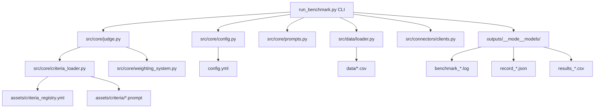
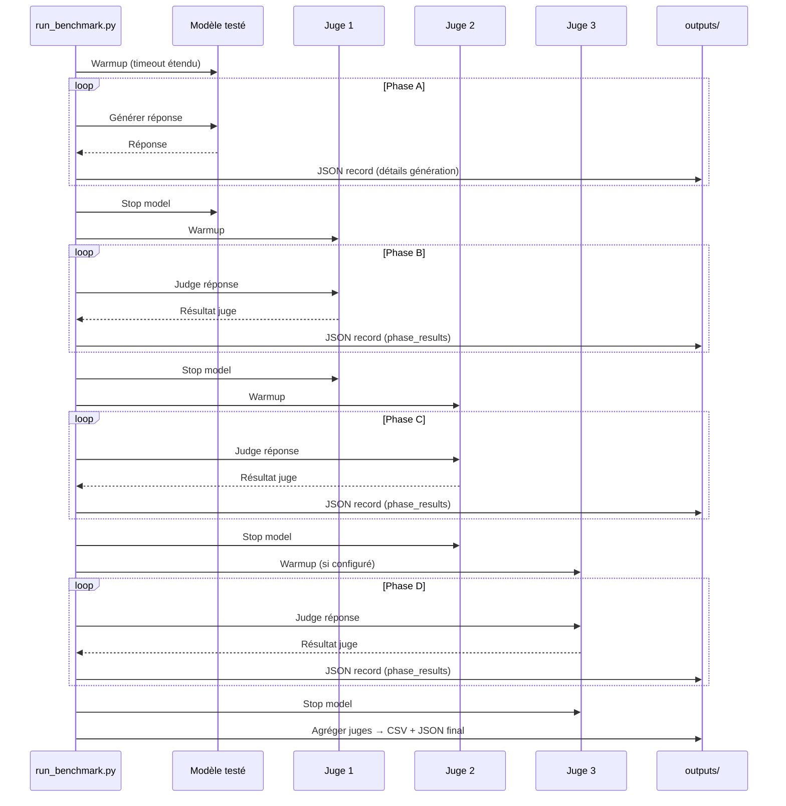

# Analyse du Projet — ChildGuard‑LLM v1.1 (refonte septembre 2025)

Version du code analysé: 1.1.0  
Date du rapport: 2025‑09‑14

Ce document reflète l’état actuel du projet après la refonte: exécution par phases, warm‑up automatique, retries réseau, arrêt explicite des modèles entre phases, options par modèle/juge dans `config.yml`, corrections de métadonnées JSON, et barres de progression.

---

## 1) Vue d’ensemble

- Objectif: benchmark de sûreté enfant pour sorties LLM avec système multi‑juges, critères modulaires, pondérations multi‑niveaux.
- Entrée CLI: `run_benchmark.py` (mode Inline ou Phased).
- Sorties: JSON détaillés par record, CSV consolidé, logs par run.

---

## 2) Architecture actuelle

Points clés de la refonte:
- Exécution par phases (évite les swaps inter‑modèles):
  - Phase A: génération avec un seul modèle testé.
  - Phases B/C/D: juges appliqués séquentiellement.
  - Arrêt explicite du modèle actif après chaque phase (`/api/stop`).
- Robustesse réseau/serveur:
  - Warm‑up automatique avant chaque phase (timeout étendu).
  - Retries x3 avec backoff 5s/10s/20s pour génération et juges.
- Options par modèle/juge transmises à Ollama, avec `keep_alive` au niveau racine du payload.
- Barres de progression (tqdm) pour génération, juges et agrégation.
- Assainissement des champs texte (NaN/None → "").
- Métadonnées JSON conformes (juges réels, n_passes, n_judges, critères agrégés).

---

## 3) Modes d’exécution

- Inline: comportement historique (modèle testé et juges dans la même boucle). Utile pour comparer rapidement.
- Phased: recommandé. Pipeline par phases, warm‑up, retries, et arrêt du modèle entre phases.

---

## 4) Configuration — points importants

- Juges (`config.yml > judge_system.judges`):
  - Acceptent désormais soit un simple nom de modèle, soit un objet `{ model, options }`.
  - `options` sont passées à l’API Ollama; `keep_alive` est envoyé au niveau racine du payload.
  - Exemples utiles: `main_gpu`, `request_timeout`, `tensor_split` (répartition multi‑GPU), `num_ctx`, `num_batch`.

- Modèles testés (`config.yml > models`):
  - Un seul `enabled: true` par run (1 modèle à la fois).
  - `options` comme pour les juges (transmises à l’API lors de la génération).

- Multi‑GPU:
  - Par défaut, Ollama n’étale pas automatiquement sur plusieurs GPUs.
  - Rendre visibles les GPUs via `CUDA_VISIBLE_DEVICES` côté service.
  - Utiliser `tensor_split: [fractions...]` pour répartir un modèle volumineux sur 2/3 GPUs.

---

## 5) Comportements ajoutés côté code

- `warmup_ollama_model(model, host, port, options)`
  - Appel court pour charger le modèle (timeout élevé, keep_alive).
- `ollama_generate_with_retries(..., attempts=3)`
  - Enveloppe résiliente avec backoff 5/10/20 s.
- `ollama_stop(model)`
  - POST `/api/stop` pour libérer la VRAM entre les phases.
- `ModelConfig.options` (config)
  - Les options par modèle (testé) sont lues et appliquées en génération.
- Tqdm
  - Barres Phase A, Juges, Agrégation; barre Inline globale.
- Sanitation
  - `_safe_str` convertit NaN/None en chaîne vide pour JSON propre.
- Métadonnées JSON
  - `metadata.judge_models` = mapping réel des juges.
  - `metadata.evaluation_settings` = `n_passes`, `n_judges`, `criteria_evaluated` corrects.

---

## 6) Données & critères

- Chargement datasets: `src/data/loader.py` (CSV/XLSX). Colonnes normalisées: `id,prompt,category,subcategory,maturity,source`.
- Personas: `assets/personas.json`.
- Critères: registry `assets/criteria_registry.yml` + fichiers `.prompt` hiérarchisés.
- Pondération: `src/core/weighting_system.py` (critère → sous‑catégorie → catégorie → score final).

---

## 7) Conseils d’exploitation

- Mode Phased + warm‑up + stop: limite les rechargements et la contention VRAM.
- Timeouts: définir `request_timeout` (ex: 300–600 s) pour les cold‑starts ou tunnel SSH.
- num_ctx / num_batch:
  - Possibles à laisser par défaut; à baisser si messages “VRAM didn’t recover”.
- GPU instables: épingler avec `main_gpu` ou restreindre `CUDA_VISIBLE_DEVICES` côté service.
- Multi‑GPU réel: exposer les GPUs au service et ajouter `tensor_split`.

---

## 8) Démarrage rapide

1. Configurer `config.yml` (juges, modèle testé, options 
   `keep_alive`, `request_timeout`, `main_gpu` [et `tensor_split` si besoin]).
2. Lancer: `python run_benchmark.py` → choisir 2 (Phased).
3. Surveiller: barres tqdm + `logs/` du run (`outputs/.../benchmark_*.log`).
4. Résultats: JSON détaillés par record + CSV consolidé.

---

## 9) Fichiers pertinents

- `run_benchmark.py`: pipeline Phased/Inline, warm‑up, retries, stop, tqdm.
- `src/connectors/clients.py`: clients providers, `ollama_generate`, `ollama_stop`.
- `src/core/judge.py`: exécution multi‑juges, N passes, retries juge, sortie V1.1.
- `src/core/criteria_loader.py`: registry et chargement des critères.
- `src/core/weighting_system.py`: agrégation pondérée multi‑niveaux.
- `config.yml`: configuration centralisée (juges, modèles, chemins, poids, etc.).

---

Fin du rapport.
