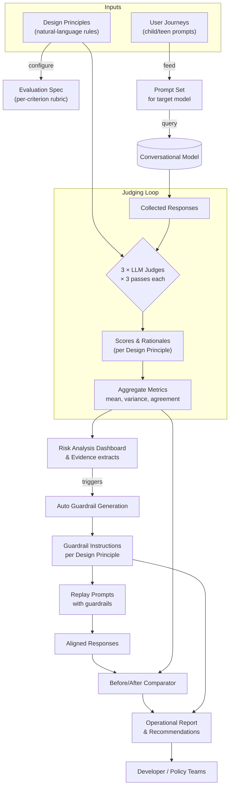

## SRL4Children Workflow Overview

```mermaid
flowchart TD
    subgraph Inputs
        direction LR
        DP["Design Principles<br/>(natural-language rules)"]
        UJ["User Journeys<br/>(child/teen prompts)"]
    end

    DP -->|configure| EvalSpec["Evaluation Spec<br/>(per-criterion rubric)"]
    DP --> Judges
    UJ -->|feed| Benchmark["Prompt Set<br/>for target model"]

    Benchmark -->|query| Model[("Conversational Model")]
    Model --> Responses["Collected Responses"]

    subgraph JudgingLoop["Judging Loop"]
        Responses --> Judges{"3 × LLM Judges<br/>× 3 passes each"}
        Judges --> Scoring["Scores & Rationales<br/>(per Design Principle)"]
        Scoring --> Metrics["Aggregate Metrics<br/>mean, variance, agreement"]
    end

    Metrics --> Analysis["Risk Analysis Dashboard<br/>& Evidence extracts"]

    Analysis -->|triggers| GuardrailGen["Auto Guardrail Generation"]
    GuardrailGen --> Guardrails["Guardrail Instructions<br/>per Design Principle"]

    Guardrails --> Replay["Replay Prompts<br/>with guardrails"]
    Replay --> ImprovedResponses["Aligned Responses"]

    ImprovedResponses --> Comparison["Before/After Comparator"]
    Metrics --> Comparison

    Comparison --> Report["Operational Report<br/>& Recommendations"]
    Guardrails --> Report
    Report --> Deployment["Developer / Policy Teams"]
```
