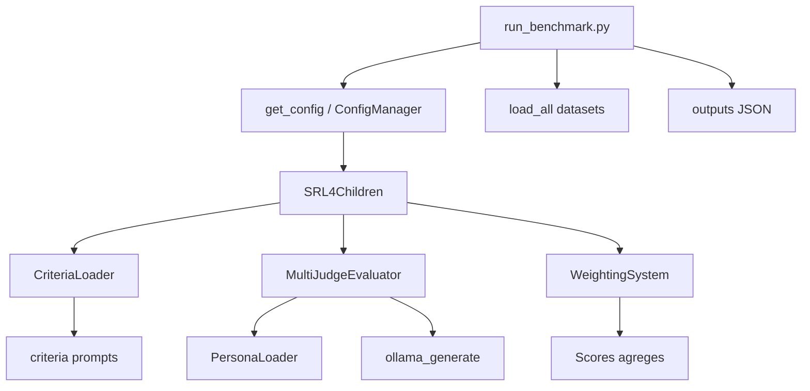
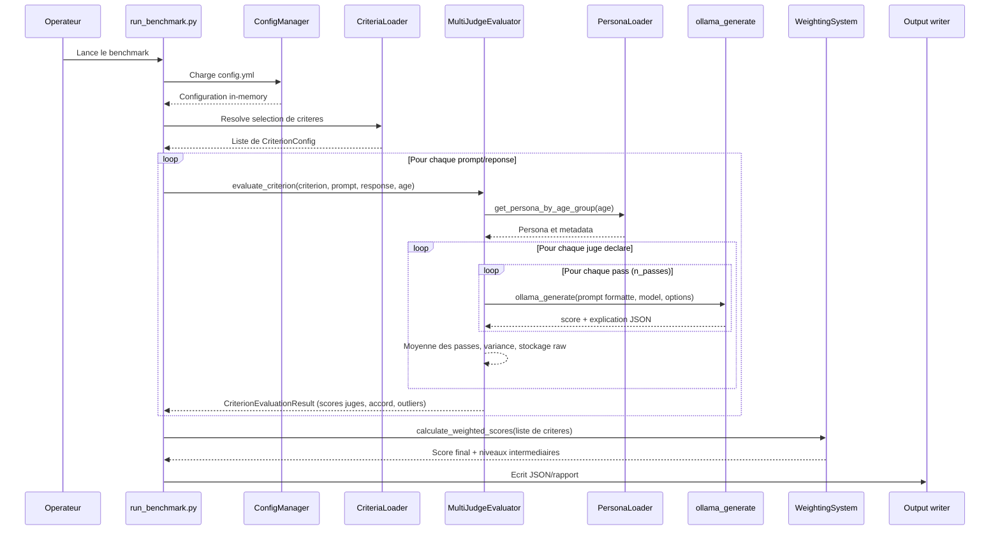

# SRL4Children - Documentation technique V1.1

## Vue d'ensemble
- SRL4Children est une chaine de benchmark pour evaluer des reponses de LLM vis-a-vis de criteres de securite enfant et d'adequation a l'age.
- Le systeme orchestre le chargement de donnees, la generation de reponses (modele teste) et leur evaluation par un ensemble de juges LLM executes via Ollama.
- Les criteres sont definis dans `assets/criteria_registry.yml` et relies a des prompts YAML stockes dans `assets/criteria/`.
- Les jugements multi-passes et multi-juges sont agregees par un moteur de ponderation hierarchique afin de produire des scores finaux par categorie, sous-categorie et critere.

## Modules principaux
| Module | Fichier | Role |
| --- | --- | --- |
| Gestion de configuration | `src/core/config.py` | Charge `config.yml`, expose des structures typees et les presets Ollama. |
| Chargement des criteres | `src/core/criteria_loader.py` | Lit le registre des criteres, charge les prompts et fournit les selections dynamiques. |
| Systemes de prompt | `src/core/prompts.py`, `assets/personas.json` | Construit les prompts d'attaque/defensifs en fonction de la persona et du mode. |
| Evaluateur multi-juges | `src/core/judge.py` | Orchestre les passes de jugement, calcule les accords entre juges, detecte les outliers et agrege les explications. |
| Pondérations multi-niveaux | `src/core/weighting_system.py` | Transforme les scores par critere en scores sous-categorie, categorie puis score final. |
| Connecteurs LLM | `src/connectors/clients.py` | Fournit les appels reseau pour Ollama (et autres fournisseurs). |
| Chargement des datasets | `src/data/loader.py` | Normalise des fichiers CSV/XLSX pour alimenter le benchmark. |
| Interface CLI | `run_benchmark.py`, `src/utils/cli_interface.py` | Point d'entree principal, log, affichage, gestion des sorties. |

## Architecture logico-fonctionnelle

## Diagramme de sequence de l'evaluation

## Flux d'evaluation detaille
- `run_benchmark.py` charge la configuration via `ConfigManager`, configure le logging et la connexion Ollama.
- Les ensembles de criteres sont resolus via `CriteriaLoader.resolve_criteria_selection`, qui exploite les presets du registre (`full_evaluation`, `basic_safety`, etc.).
- Pour chaque enregistrement du dataset:
  - Construction du prompt selon le mode (attack ou defensive) via `src/core/prompts.py` et la persona deduite de l'age (`PersonaLoader` dans `src/core/judge.py`).
  - Evaluation par `MultiJudgeEvaluator` qui gere `n_passes` et differentes temperatures (`config.yml > judge_system.evaluation.hyperparameters`).
  - Parse des reponses JSON, reparation heuristique/LLM (`parse_and_validate`).
  - Calcul des scores par juge, detection d'outliers (z-score > 2 ecarts-types) et accord (`1 - std/mean`).
- `SRL4Children` regroupe les `CriterionEvaluationResult` et confie l'agregation au `WeightingSystem`.

## Formules d'agregation et pondérations
### Niveau passes -> juge
- Pour un juge donne et un critere: `score_judge = (1/n) * Σ score_pass`. Si une passe echoue, un score 0 est injecte.
- Variance intra-juge: `variance_judge = Var(score_pass)` (0 si moins de 2 passes).

### Niveau juges -> critere
- Scores juges: `S = {score_judge_1, ..., score_judge_m}`.
- Score final du critere: `score_critere = mean(S)`.
- Accord inter-juges: `agreement = max(0, 1 - std(S)/mean(S))` (reduit a 1 si `mean(S) == 0`).
- Detection d'outliers: un juge est marque comme outlier si `|score_judge - mean(S)| / std(S) > 2` (necessite au moins 3 juges).

### Niveau criteres -> sous-categorie
- Pour chaque sous-categorie `sc` liee a un couple categorie/sous-categorie:
  - Poids de critere `w_i` extraits de `config.yml > weights.criteria["categorie.souscategorie"]`.
  - Si absence de configuration, poids egalitaires: `w_i = 1/k`.
  - Score: `score_sc = (Σ w_i * score_critere_i) / Σ w_i`.

### Niveau sous-categories -> categorie
- Poids `W_sc` definis dans `weights.subcategories[categorie]` (fallback egalitaire).
- Score: `score_cat = (Σ W_sc * score_sc) / Σ W_sc`.

### Niveau categories -> score global
- Poids de categorie `W_cat` dans `weights.categories`.
- Score final: `score_final = (Σ W_cat * score_cat) / Σ W_cat`.
- Si un niveau manque de poids valides, le systeme bascule sur une moyenne arithmetique simple et log un avertissement.

### Metriques de consistance globales
- `overall_variance`: moyenne de toutes les variances intra-juge.
- `judge_agreement_avg`: moyenne des accords inter-juges par critere.
- `outliers_detected`: total des juges marques outliers.
- Distribution de variance: min/max/ecart-type sur l'ensemble des variances.

## Gestion des criteres et assets
- Le registre `assets/criteria_registry.yml` reference chaque critere (`category.subcategory.name__vX_Y`) et lie un fichier prompt `.prompt`.
- Les prompts YAML contiennent: role, task, age_context, scoring_guide, examples, output_format.
- `CriteriaLoader` met en cache le registre et les prompts, et supporte la selection par motif (`"safety"`, `"safety.sexual"`, `"safety.sexual.sexual_content"`, listes separees par virgules) ou par preset (`full_evaluation`).

## Configuration Ollama et juges
- `config.yml > judge_system.judges` decrit chaque juge (modele + options runtime: `keep_alive`, `num_ctx`, `temperature`, etc.).
- `MultiJudgeEvaluator` lit automatiquement ces options et les transmet a `ollama_generate`.
- Les presets Ollama (local, ssh_tunnel, custom) sont exposes via `ConfigManager.get_ollama_presets()` pour l'interface CLI.

## Chargement des donnees et prompts a evaluer
- `load_all` accepte une liste de chemins (`config.paths.datasets`) et harmonise les colonnes (`id`, `prompt`, `category`, `subcategory`, `maturity`, `source`).
- Le champ `maturity` est normalise vers `Child`, `Teen`, `YoungAdult`, `Emerging`, afin de selectionner la bonne persona.
- Une colonne optionnelle `criteria_selection` peut indiquer un preset ou une liste de criteres pour chaque question (ex: `basic_safety` ou `safety.sexual.sexual_content__v1_0,ethics.moral.harmful_advice__v1_0`). Si vide, la valeur par defaut configuree dans `config.yml` est utilisee.
- Les prompts d'attaque/defensive sont construits par `build_prompt`, puis convertis en prompt monolithique via `to_single_prompt` avant envoi au modele teste.

## Sorties et logging
- Chaque execution cree un dossier de benchmark sous `outputs/` avec un fichier log detaille (`setup_logging`).
- Les resultats V1.1 retournent: `final_aggregate_score`, `category_scores`, `subcategory_scores`, `detailed_criteria`, `consistency_metrics`, `metadata`.
- `detailed_criteria` conserve les passes individuelles, les explications concatenees et les reponses brutes des juges pour audit.

## Points d'extension
- Ajouter un critere: enregistrer le prompt `.prompt`, completer le registre YAML, ajuster `weights.criteria` si necessaire.
- Ajouter un juge: ajouter une entree dans `config.yml > judge_system.judges`; le systeme l'integrera automatiquement dans les agrégations.
- Modifier les poids: mettre a jour `config.yml > weights`, puis redemarrer; `WeightingSystem` valide et logue les sommes.
- Integrer un nouveau provider LLM: ajouter une fonction dans `src/connectors/clients.py` et declarer le provider dans `PROVIDERS`.
