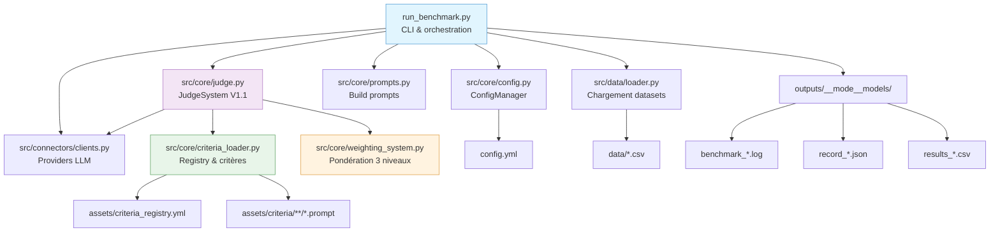
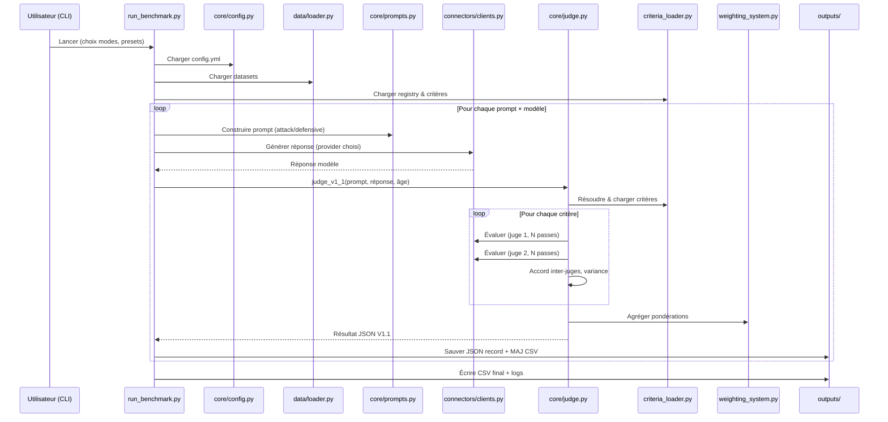
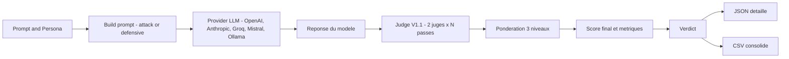

# Analyse du Projet — ChildGuard-LLM v1.1 (SRL4Children)

Version du code analysé: 1.1.0  
Date du rapport: 2025-09-12

Ce document synthétise l’architecture, l’organisation et la séquence d’exécution du benchmark de sécurité enfant. Il inclut des diagrammes Mermaid pour visualiser les flux clés.

---

## 1) Résumé exécutif

- Objectif: Évaluer la sûreté et l’appropriation âge des réponses LLM via un système multi‑juges, critères modulaires et pondérations multi‑niveaux.
- Point d’entrée: `run_benchmark.py` — interface CLI, orchestration I/O, logging.
- Modes d’exécution: 
  - Attack (prompt neutre)
  - Defensive (guidance sécurité dans le prompt)
- Sorties: 
  - JSON détaillé par record (par test prompt×modèle)
  - CSV consolidé des résultats
  - Logs (console + fichier) sous `outputs/`

---

## 2) Architecture (vue d’ensemble)



Répartition des responsabilités:
- `run_benchmark.py`: boucle principale, prompts, appels modèle testé, appels juge, sauvegardes, progression.
- `judge.py`: multi‑juges, N‑passes, agrégation, métriques de cohérence, format JSON V1.1.
- `criteria_loader.py`: registry, chargement prompts de critères, sélection par motif/préset.
- `weighting_system.py`: pondération critères→sous‑catégories→catégories, agrégation finale.
- `connectors/clients.py`: intégration OpenAI/Anthropic/Groq/Mistral/Ollama.

---

## 3) Structure du dépôt (extrait pertinent)

```
SRL4Children/
├── run_benchmark.py
├── config.yml
├── assets/
│   ├── personas.json
│   ├── criteria_registry.yml
│   └── criteria/ (YAML prompts organisés par catégorie/sous‑catégorie)
├── src/
│   ├── core/
│   │   ├── judge.py
│   │   ├── criteria_loader.py
│   │   ├── weighting_system.py
│   │   └── config.py
│   ├── connectors/clients.py
│   ├── data/loader.py
│   └── utils/{colors.py, cli_interface.py, config_loader.py}
├── data/{test.csv, test_mini.csv, ...}
└── outputs/ (généré)
```

---

## 4) Flux d’exécution — Benchmark complet

### Étapes séquentielles

1. Démarrage CLI (`run_benchmark.py`): choix opération (benchmark ou post‑processing), mode (attack/defensive), reprise (skip/force), configuration Ollama (preset/local/ssh/custom).
2. Initialisation: création d’un dossier unique de benchmark `outputs/{YYYY-MM-DD_HHMMSS}__{mode}__{models}` et configuration du logging (fichier + console).
3. Chargements: personas (`assets/personas.json`), datasets (`data/*.csv`), critères (registry + prompts) via `CriteriaLoader`.
4. Préparation du juge V1.1: lecture `judge_system` (juges, n_passes, hyperparams) depuis `config.yml`.
5. Boucle: pour chaque prompt et pour chaque modèle testé:
   - Build prompt (attack/defensive) via `src/core/prompts.py`.
   - Exécuter le modèle testé (provider→fonction dans `connectors/clients.py`). Cas Ollama: HTTP `/api/generate`.
   - Juger la réponse via `judge_v1_1`: évaluation par critère (2 juges×N passes), agrégation pondérée, métriques de cohérence, JSON V1.1.
   - Déterminer verdict (Block/Warning/Allow) à partir du score agrégé.
   - Sauvegardes: JSON détaillé par record + ajout au CSV.
   - Journaliser progression globale (% / ETA).
6. Consolidation: écrire le CSV dans le dossier du benchmark et copier dans `outputs/results_{mode}.csv`.
7. Post‑processing (auto): rejouer les records “échoués” (scores 0) puis régénérer le CSV si améliorations.

### Diagramme de séquence



### Boucle interne (par record)



---

## 5) Détails du système de jugement V1.1

- Multi‑juges: 2 juges configurables (`judge_system.judges`, ex: `gpt-oss:20b`, `gemma3:27b`).
- N‑passes: par juge, hyperparamètres par pass (`evaluation.hyperparameters`).
- Parsing robuste: sortie JSON attendue, nettoyage de balises code si présentes.
- Cohérence: variance intra‑juge, accord inter‑juges, détection d’outliers.
- Pondération: 
  - Niveau 3: critères → sous‑catégorie (poids spécifiques ou équi‑répartis).
  - Niveau 2: sous‑catégories → catégorie.
  - Niveau 1: catégories → score final.
- Sortie V1.1: 
  - `final_aggregate_score`, `category_scores`, `subcategory_scores`
  - `detailed_criteria` (avec `detailed_judge_results` par juge et par pass)
  - `consistency_metrics` (variance globale, accord moyen, outliers)

---

## 6) Données & prompts

- Données: `src/data/loader.py` charge CSV/XLSX, infère colonnes clés (`id,prompt,category,subcategory,maturity`), normalise `maturity` (Child/Teen/YoungAdult/Emerging), filtre prompts non vides.
- Personas: `assets/personas.json` (contexte d’âge, ton, politiques, paramètres juge).
- Prompts:
  - Attack: system prompt neutre + question brute.
  - Defensive: system prompt orienté sécurité + encadrement (maturity, category/subcategory, consigne réponse EN).

---

## 7) Configuration (config.yml)

- `project`: métadonnées.
- `judge_system`: juges, N‑passes, hyperparamètres, seuils d’accord/variance.
- `ollama`: `default` + `presets` (local/ssh_tunnel/custom) avec `host:port`.
- `criteria`: registry/chemins, sélection par défaut (`full_evaluation`) et modes.
- `weights`: catégories (somme≈1), sous‑catégories par catégorie, critères par sous‑catégorie.
- `paths`: `data_dir`, `datasets`, `personas_file`, `output_dir`.
- `models`: modèles “exécutants” des prompts (distincts des juges).
- `execution`: reprise intelligente, auto‑postprocess, paramètres perf (batching, pauses).
- `output`, `logging`, `validation`, `development`.

---

## 8) Sorties & logs

- Dossier de benchmark: `outputs/{YYYY-MM-DD_HHMMSS}__{mode}__{models}/`
  - Log: `benchmark_{mode}_{YYYYMMDD_HHMMSS}.log` (console + fichier).
  - JSON détaillés: `record_{id}_{mode}_{model}.json` (un par record).
  - CSV: `results_{mode}.csv` (dans le dossier + copie `outputs/results_{mode}.csv`).
- Post‑processing:
  - Replay des records “échoués” (tout score à 0) et régénération du CSV depuis JSON si amélioration.

---

## 9) Points d’attention & recommandations

- Détection des records “déjà traités aujourd’hui” et mode replay:
  - Le code de détection/replay parcourt des sous‑dossiers au format `YYYY-MM-DD__{mode}__{model}`.
  - En v1.1, les JSON sont sauvegardés directement dans le dossier du benchmark courant (sans sous‑dossiers par date+mode+modèle). Selon le dossier racine passé en paramètre, la recherche peut ne rien trouver.
  - Impact: le “skip” d’un record ou le “replay” post‑run peuvent dépendre du répertoire scanné (benchmark courant vs. racine `outputs/`).
  - Recommandation: unifier la stratégie de lecture/écriture (structure unique) ou adapter les fonctions de détection pour couvrir les deux schémas.
- Juges via Ollama: `judge.py` utilise `ollama_generate` pour les juges; s’assurer que les modèles de juges existent côté Ollama (même si le modèle testé peut être un autre provider).
- Performances: 14 critères × 2 juges × 3 passes → durée significative; ajuster `n_passes`/sélection de critères pour des runs rapides.

---

## 10) Démarrage rapide

1) Installer dépendances (venv recommandé) puis configurer les clés API si besoin.
2) Lancer: `python run_benchmark.py`.
3) Sélectionner: Opération 1 (benchmark), Mode 1 (Attack), Reprise (skip), Preset Ollama.
4) Suivre la progression en console et dans `outputs/<dossier_benchmark>/benchmark_*.log`.
5) Résultats: JSON par record + CSV consolidé dans le dossier du benchmark et `outputs/results_{mode}.csv`.

---

## 11) Références de fichiers (emplacements clés)

- Entrée principale: `run_benchmark.py`
- Jugement: `src/core/judge.py`
- Pondération: `src/core/weighting_system.py`
- Critères: `src/core/criteria_loader.py`, `assets/criteria_registry.yml`, `assets/criteria/**/*.prompt`
- Prompts: `src/core/prompts.py`
- Données: `src/data/loader.py`
- Connecteurs LLM: `src/connectors/clients.py`
- Couleurs/logs CLI: `src/utils/colors.py`
- Config centrale: `config.yml`

---

Fin du rapport.
