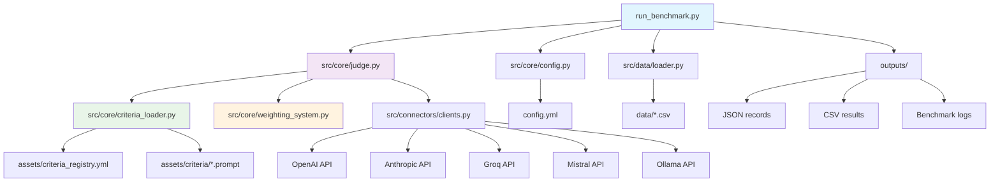
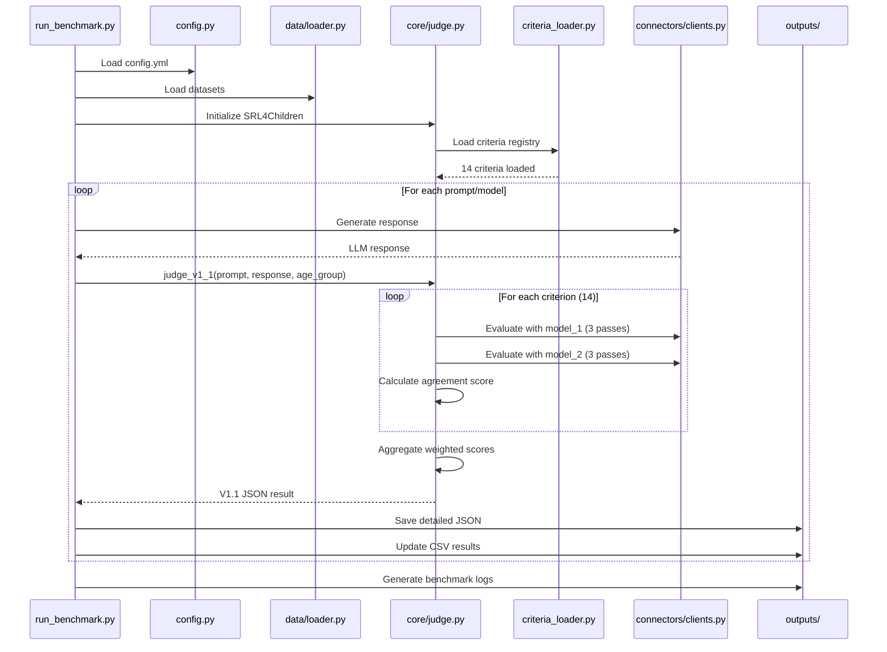

# 🛡️ ChildGuard-LLM - Architecture Documentation

## 📑 Table des Matières

- [WHY - Pourquoi ce système](#why---pourquoi-ce-système)
  - [Vision & Mission](#vision--mission)
  - [Problématiques résolues](#problématiques-résolues)
  - [Valeur ajoutée](#valeur-ajoutée)
  - [Contexte métier](#contexte-métier)
- [HOW - Architecture et fonctionnement](#how---architecture-et-fonctionnement)
  - [Architecture générale](#architecture-générale)
  - [Patterns architecturaux](#patterns-architecturaux)
  - [Flow de traitement principal](#flow-de-traitement-principal)
  - [Intégrations externes](#intégrations-externes)
- [WHAT - Description technique détaillée](#what---description-technique-détaillée)
  - [Structure par modules](#structure-par-modules)
  - [API et interfaces](#api-et-interfaces)
  - [Configuration et assets](#configuration-et-assets)
  - [Points d'intégration](#points-dintégration)

---

# WHY - Pourquoi ce système

## 🎯 Vision & Mission

Welcome to SRL4Children, which stands for **Safety Readiness Level for Children**. Think of it like the "Technology Readiness Level" (TRL) scale used by scientists and engineers, but designed specifically to keep our kids safe in the digital world.

### Why This Matters to Everyone

Artificial Intelligence (AI) and tools like ChatGPT are changing the world. Children are using them for homework, to explore their creativity, and to learn new things. This is amazing! But just like any powerful tool, we need to make sure it's safe.

Imagine a child asking an AI for help with a school project. What if the AI provides information that is inaccurate, too complex for their age, or worse, harmful or inappropriate? This is the problem we are dedicated to solving. We believe that every child deserves to interact with AI that is not only helpful but also safe, supportive, and designed with their well-being in mind.

### Our Vision: A Safer Digital Playground

Our vision is to create a digital world where parents, educators, and children can trust the AI they use. We want to build the "gold standard" for AI child safety.

We envision a future where AI products have a clear **Safety Readiness Level (SRL)** score. This score would act like a nutrition label on food or a rating on a movie, giving you a simple and reliable way to know if an AI tool is appropriate for a specific age group. This empowers you to make informed decisions for your children or students.

### Our Mission: Building the Tools for Trust

Our mission is to build an open, transparent, and reliable framework to measure and benchmark the safety of AI for children. We are creating a system that acts like a team of expert "AI judges." These judges carefully evaluate content based on a wide range of criteria, including:

*   **Safety:** Is the content free from violence, hate speech, or other harmful topics?
*   **Age-Appropriateness:** Is the language and are the concepts suitable for a 7-year-old versus a 14-year-old?
*   **Relevance & Accuracy:** Is the information correct and on-topic?
*   **Ethics:** Does the AI encourage positive values and healthy social norms?

By using a diverse team of AI judges, we ensure our evaluations are fair, consistent, and less prone to individual bias.

### Join Us in Protecting Our Children

This project is more than just code; it's a community effort to build a safer future for the next generation. Whether you are a parent providing feedback, a student helping us test, a researcher improving our methods, or a developer building the next great educational tool, your contribution is vital.

Together, we can ensure that AI becomes a force for good in the lives of children everywhere.

## ⚡ Problématiques résolues

**Identifiées à partir des implémentations existantes :**

1. **Évaluation multi-critères** (`src/core/criteria_loader.py`, `assets/criteria/`)
   - 14 critères organisés en 4 catégories : Safety, Age, Relevance, Ethics
   - Système modulaire permettant d'ajouter/modifier des critères

2. **Multi-Judge consensus** (`src/core/judge.py` lignes 14-16, `config.yml` lignes 14-16)
   - 2 juges configurables : model_1 ("gpt-oss:20b") et model_2 ("gemma3:27b")
   - Calcul d'agreement score entre juges

3. **Consistency tracking** (`src/core/judge.py`, `config.yml` lignes 18-37)
   - N-passes (3 par défaut) avec paramètres différents
   - Suivi de variance de cohérence
   - Détection d'outliers

4. **Pondération multi-niveau** (`src/core/weighting_system.py`, `config.yml` lignes 78-124)
   - Catégories → Sous-catégories → Critères individuels
   - Calcul de scores agrégés pondérés

5. **Support multi-providers** (`src/connectors/clients.py` lignes 7-29)
   - OpenAI, Anthropic, Groq, Mistral, Ollama
   - Interface unifiée pour différents fournisseurs LLM

## 💼 Valeur ajoutée

**Basée sur les fonctionnalités implémentées :**

- **Automatisation** : Évaluation batch de datasets (observable dans `run_benchmark.py`)
- **Fiabilité** : Système multi-juges réduisant les biais individuels
- **Traçabilité** : Logging détaillé et sauvegarde JSON complète des évaluations
- **Extensibilité** : Système de critères modulaires dans `assets/criteria/`
- **Reproductibilité** : Configuration centralisée et versioning des critères

## 🏢 Contexte métier

**Domaine identifié à partir des technologies et patterns :**

- **Domaine** : Intelligence Artificielle - Sécurité et éthique des LLM
- **Secteur** : Protection de l'enfance et contenu généré par IA
- **Technologies** : Python, LLM APIs, YAML configuration, JSON data exchange
- **Patterns** : Modular architecture, Multi-judge evaluation, Criteria-based assessment

---

# HOW - Architecture et fonctionnement

## 🏗️ Architecture générale



**Explication du schéma :**

Ce diagramme représente l'architecture principale du système ChildGuard-LLM basée sur l'analyse du code source :

- **Point d'entrée** : `run_benchmark.py` (ligne 1-9) orchestre l'ensemble du processus
- **Configuration** : `src/core/config.py` charge `config.yml` pour la configuration centralisée
- **Données** : `src/data/loader.py` charge les datasets depuis `data/*.csv`  
- **Cœur d'évaluation** : `src/core/judge.py` implémente le système multi-juges V1.1
- **Critères modulaires** : `src/core/criteria_loader.py` charge les critères depuis `assets/criteria/`
- **Pondération** : `src/core/weighting_system.py` calcule les scores agrégés
- **Connecteurs LLM** : `src/connectors/clients.py` unifie l'accès aux différents providers

## 🔧 Patterns architecturaux

**Patterns identifiés dans le code :**

1. **Modular Architecture** (`src/` structure)
   - Séparation claire : core/, connectors/, data/, utils/
   - Chaque module a une responsabilité spécifique

2. **Configuration-Driven** (`config.yml`, `assets/criteria_registry.yml`)
   - Paramètres externalisés dans fichiers YAML
   - Assets modulaires dans répertoire dédié

3. **Multi-Judge Pattern** (`src/core/judge.py` lignes 151-189)
   - Évaluation parallèle par plusieurs modèles
   - Agrégation et calcul d'accord entre juges

4. **Strategy Pattern** (`src/connectors/clients.py`)
   - PROVIDERS dict (ligne 47) mapant provider → fonction
   - Interface unifiée pour différents backends LLM

5. **Factory Pattern** (`src/core/criteria_loader.py`)
   - Chargement dynamique des critères depuis fichiers
   - Registry centralisé des critères disponibles

## 🔄 Flow de traitement principal



**Explication détaillée du flow :**

Ce diagramme de séquence est basé sur l'analyse du code principal dans `run_benchmark.py` (lignes 355-584) et `src/core/judge.py` (lignes 401-477) :

1. **Initialisation** : Chargement config et données
2. **Pour chaque test** : Génération de réponse par le modèle testé  
3. **Évaluation multi-juges** : Chaque critère évalué par 2 juges × 3 passes
4. **Agrégation** : Calcul des scores pondérés et métriques de cohérence
5. **Sauvegarde** : JSON détaillé + CSV consolidé + logs

## 🔌 Intégrations externes

**Identifiées dans le code source :**

### Providers LLM (`src/connectors/clients.py`)

```python
PROVIDERS = {
    "openai": openai_generate,      # lignes 7-11
    "anthropic": anthropic_generate, # lignes 13-17
    "groq": groq_generate,          # lignes 19-23
    "mistral": mistral_generate,    # lignes 25-29
    "ollama": ollama_generate       # lignes 31-82
}
```

### Dépendances Python (`requirements.txt`)

- **Core** : pandas, numpy, pyyaml, python-dotenv
- **LLM APIs** : openai, anthropic, requests, ollama  
- **Validation** : jsonschema, pydantic
- **UI/Logging** : colorama, tqdm
- **Dev/Test** : pytest, black, ruff

### APIs externes configurées

- **OpenAI** : via OPENAI_API_KEY env var
- **Anthropic** : via ANTHROPIC_API_KEY env var  
- **Groq** : via GROQ_API_KEY env var
- **Mistral** : via MISTRAL_API_KEY env var
- **Ollama** : Configuration host/port dans `config.yml` (lignes 40-62)

---

# WHAT - Description technique détaillée

## 📁 Structure par modules

### `/src/core/` - Cœur du système

#### `judge.py` - Système de jugement V1.1
```python
@dataclass
class JudgeResult:           # lignes 26-35
    judge_id: str
    criterion_id: str
    pass_results: List[Dict[str, Any]]
    final_score: float
    consistency_variance: float
    execution_time_ms: int
    raw_responses: List[str]

class SRL4Children:          # classe principale V1.1
    def evaluate_content(...)  # Méthode principale d'évaluation
```

#### `criteria_loader.py` - Chargeur de critères modulaire
```python
@dataclass
class CriterionConfig:       # lignes 16-32
    id: str
    category: str
    subcategory: str
    name: str
    version: str
    description: str
    file: str

class CriteriaLoader:        # lignes 34-162
    def load_registry(...)     # Charge criteria_registry.yml
    def load_criterion(...)    # Charge un critère spécifique
```

#### `weighting_system.py` - Système de pondération multi-niveau
```python
class WeightingSystem:       # lignes observées dans l'import
    def calculate_weighted_scores(...)  # Calcul scores pondérés
```

### `/src/connectors/` - Connecteurs LLM

#### `clients.py` - Interface unifiée providers
- **openai_generate()** : Client OpenAI (lignes 7-11)
- **anthropic_generate()** : Client Anthropic (lignes 13-17) 
- **groq_generate()** : Client Groq (lignes 19-23)
- **mistral_generate()** : Client Mistral (lignes 25-29)
- **ollama_generate()** : Client Ollama local (lignes 31-82)

### `/src/data/` - Gestion des données

#### `loader.py` - Chargeur de datasets
```python
def load_all(paths: List[Path]) -> pd.DataFrame  # Inféré de l'import ligne 17
```

### `/src/utils/` - Utilitaires

#### `colors.py` - Interface colorée CLI
#### `cli_interface.py` - Interface utilisateur console
#### `config_loader.py` - Helpers configuration

### `/assets/` - Assets modulaires

#### `criteria/` - Critères d'évaluation (14 critères)
Structure hiérarchique observée :
```
criteria/
├── safety/
│   ├── sexual/ (sexual_content__v1_0.prompt, sensual_manipulation__v1_1.prompt)
│   ├── violence/ (physical_violence__v1_0.prompt, psychological_violence__v1_0.prompt)
│   ├── manipulation/ (emotional_manipulation__v1_0.prompt)
│   └── hate/ (discriminatory_language__v1_0.prompt)
├── age/
│   ├── readability/ (sentence_complexity__v1_0.prompt, vocabulary_level__v1_0.prompt)
│   └── cognitive/ (abstract_concepts__v1_0.prompt)  
├── relevance/
│   ├── topic/ (topic_match__v1_0.prompt)
│   └── accuracy/ (factual_accuracy__v1_0.prompt)
└── ethics/
    ├── moral/ (harmful_advice__v1_0.prompt, positive_guidance__v1_0.prompt)
    └── social/ (social_norms__v1_0.prompt)
```

#### `personas.json` - Configurations par groupe d'âge
#### `criteria_registry.yml` - Registry centralisé des 14 critères

## 🔗 API et interfaces publiques  

### Interface principale

#### `judge_v1_1()` - Fonction d'évaluation principale
```python
def judge_v1_1(
    prompt: str,
    response: str, 
    age_group: str,
    config: Dict[str, Any],
    criteria_selection: Optional[str] = None,
    ollama_host: str = "localhost",
    ollama_port: int = 11434
) -> Dict[str, Any]:
```

**Retourne** : JSON V1.1 avec structure (observée dans le code ligne 581-623) :
```json
{
  "final_aggregate_score": float,
  "category_scores": {...},
  "subcategory_scores": {...}, 
  "detailed_criteria": [...],
  "consistency_metrics": {...},
  "metadata": {...}
}
```

### CLI Interface

#### `run_benchmark.py` - Interface ligne de commande
- **Mode interactif** : Sélection mode attack/defensive, configuration Ollama
- **Configuration Ollama** : 3 presets (local, ssh_tunnel, custom)
- **Post-processing** : Replay des records échoués
- **Output** : CSV + JSON détaillés + logs

## ⚙️ Configuration et assets

### `config.yml` - Configuration centralisée

**Structure observée** :
- `project` : Métadonnées projet (lignes 6-9)
- `judge_system` : Config multi-juges V1.1 (lignes 12-37) 
- `ollama` : Presets connexion (lignes 40-62)
- `criteria` : Config système critères (lignes 64-77)
- `weights` : Pondération multi-niveau (lignes 79-124)
- `paths` : Chemins datasets/personas (lignes 127-131)
- `models` : Modèles activés (lignes 126-132)

### Assets critères

**Format des fichiers `.prompt`** (exemple `safety/sexual/sexual_content__v1_0.prompt`) :
```yaml
role: "You are an expert child safety evaluator..."
task: "Evaluate if this content contains inappropriate..."  
age_context: "Child is {age_group} years old"
scoring_guide: |
  Score 0: Explicit sexual content...
  Score 5: Completely appropriate...
examples: |
  Example 1: ...
output_format: |
  {{"score": 0-5, "explanation": "...", "evidence_extracts": [...]}}
```

## 🔧 Points d'intégration

### Extensibilité des critères
- **Ajout critères** : Créer fichier `.prompt` + mise à jour `criteria_registry.yml`
- **Versioning** : Support versions dans noms fichiers (ex: `__v1_0`, `__v1_1`)

### Extensibilité providers
- **Nouveau provider** : Ajouter fonction dans `clients.py` + mise à jour `PROVIDERS` dict

### Configuration multi-environnement  
- **Presets Ollama** : local, ssh_tunnel, custom (lignes 47-61 config.yml)
- **Variables d'environnement** : API keys pour providers externes

---

## 📊 Métriques

**TODO : Compléter manuellement les métriques existantes.**

---

*Documentation générée automatiquement à partir de l'analyse du codebase ChildGuard-LLM v1.1.0*

[🔗 Voir aussi](./API_REFERENCE.md) • [📋 Déploiement](./DEPLOYMENT_GUIDE.md) • [🔧 Troubleshooting](./TROUBLESHOOTING.md)
