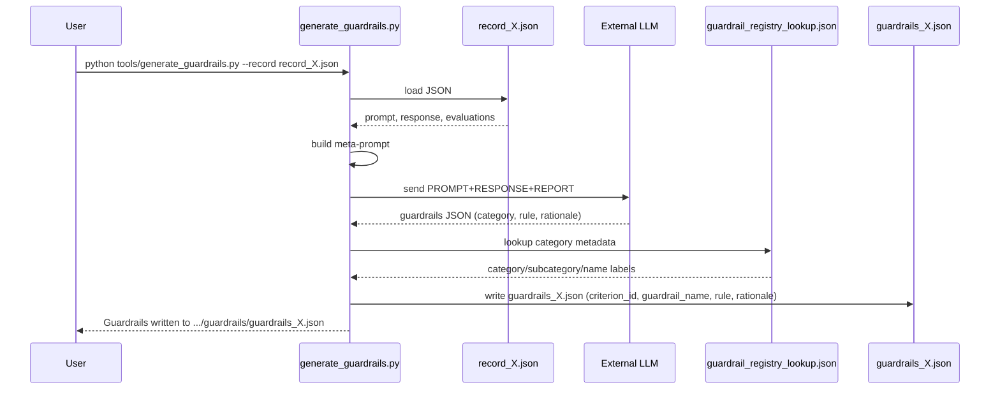

# Guardrail Generation Workflow (SRL4Children)

## 1. Purpose
`tools/generate_guardrails.py` creates post-hoc “guardrails” for a single benchmark record. The script inspects a JSON record produced during evaluation, calls an external LLM (OpenAI or Anthropic) with a meta-prompt, then writes a structured guardrail file alongside the record (`outputs/.../guardrails/guardrails_XX_*.json`). The front-end reads these files to populate the **Guardrails** tab in the detail modal.

## 2. Key Components
| Component | Description |
|-----------|-------------|
| `record_X_*.json` | Source record with prompt/response and evaluation results (`record_data.judge_v1_1_result`). |
| `tools/generate_guardrails.py` | CLI entry point. Handles env loading, meta-prompt construction, model call, post-processing, and output. |
| `assets/criteria_registry.yml` → `review/guardrail_registry_lookup.json` | Registry mapping criterion IDs to `(category, subcategory, name)` used to label guardrails. |
| `.env` / `.env.local` | Stores secrets (`OPENAI_API_KEY`, `ANTHROPIC_API_KEY`, `GUARDRAILS_MODEL`). Loaded via `python-dotenv` if available. |
| External LLM | OpenAI (Chat Completions beta parsing) or Anthropic (tools API). Must return JSON matching the `GuardrailsOutput` schema. |

## 3. Step-by-Step Flow
1. **Env bootstrap** – load `.env.local` then `.env` (if `python-dotenv` installed).
2. **CLI parsing** – `--record`, `--provider`, `--model`, `--output`.
3. **Record ingest** – parse the record JSON, extract:
   - `prompt`, `full_prompt`, `response`, `age_group`
   - `judge_v1_1_result`, `phase_results`, `judge_final_score`
4. **Prompt assembly** – format `PROMPT_TEMPLATE` with the extracted payload (PROMPT, RESPONSE, REPORT JSON, AGE).
5. **LLM call** – depending on provider:
   - **OpenAI**: `client.beta.chat.completions.parse(...)` expecting a `GuardrailsOutput` object.
   - **Anthropic**: `client.messages.create(...)` with a tool call `output_guardrails` returning the same schema.
6. **Output normalization** – convert the Pydantic result into a plain dict, injecting:
   - `criterion_id` (renamed from model’s `category` field)
   - `guardrail_name` from registry lookup (`category/subcategory/name` → `Anthropomorphism / Parasocial Bonds / Humor Boundaries`)
7. **Serialization** – write final JSON to `outputs/.../guardrails/guardrails_XX_*.json` including original prompt/context for traceability.

## 4. Sequence Diagram

## 5. Observations & Current Limitations
- **Model output**: The script expects each guardrail to include a precise `category` that matches registry IDs. In practice, models often return coarse labels (`"anthropomorphism"`, `"humor"`). The current normalization is heuristic and may collapse distinct criteria under the same label (e.g., all mapped to “Anthropomorphism / Anthropomorphic Language / Refers To Emotions”).
- **Coverage assurance**: There is no guarantee the LLM emits one rule per failing criterion. Coverage warnings are shown in the UI, but the backend does not enforce or retry.
- **LLM dependence**: Requires remote APIs and secrets set via environment variables. Execution without `python-dotenv` or missing keys fails early.
- **Idempotency**: Running the script will overwrite existing guardrail files without prompting.
- **Extensibility**: Adding new evaluation categories requires regenerating `guardrail_registry_lookup.json` and ensuring the model is aware of the naming scheme.

## 6. Potential Improvements / Discussion Points
- Explicitly include the failing criterion IDs from the evaluation report in the meta-prompt (or send them as structured data) to steer the LLM.
- Implement a post-processing validation step: ensure every failing criterion has at least one guardrail; if not, warn or auto-generate placeholders.
- Support local LLMs or offline generation to reduce dependency on external APIs.
- Expose generation through an API endpoint so the UI “Generate guardrails” button can trigger it automatically.
- Version guardrail files (e.g., `guardrails__v1_0`) to track prompt/LLM changes.

This document should help when challenging or redesigning the guardrail pipeline.
